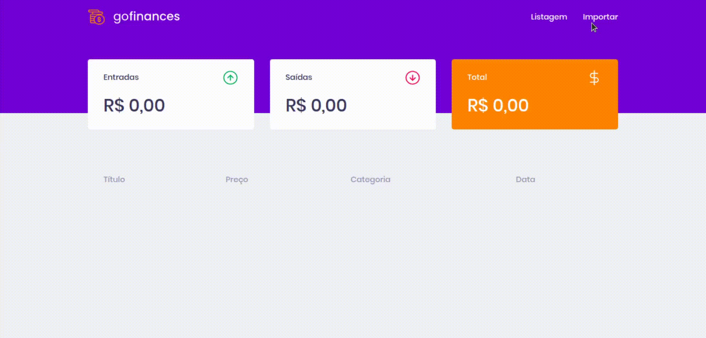

<h1 align=center>
   💲 GoFinances 💲
</h1>

<p align=center>
  Um App ReactJS para gestão de transações financeiras 💸
</p><p align=center>

<p align=center>
  

  

  
</p>



<h2>
  Sobre o projeto 🤯
</h2>

<p>
  O GoFinances faz parte de um exercício proposto durante o bootcamp GoStack 12, da Rocketseat, para consumir a seguinte <a href="https://github.com/lucascprazeres/GoFinances-server">api</a>. Podemos criar transações de depósito/saque (por enquanto, apenas com arquivos csv como <a href="https://github.com/Rocketseat/bootcamp-gostack-desafios/blob/master/desafio-database-upload/assets/file.csv">esse</a>) e visualizar suas informações na dashboard.
</p>

<h2>Teste você mesmo 😎</h2>

```bash
# clone o repositório

git clone <link-do-repositorio>

# Navegue até a pasta e carregue as dependências

cd GoFinances-web && yarn

# Rode o projeto!

yarn start

```
<em>obs: execute o mesmo processo no repositório da api, para ter o back-end integrado.</em>

<h2>Como contribuir? 🤔💭</h2>

<em>antes de tudo, faça um fork do repositório, mais acima</em>

```bash
# crie sua branch para realizar alterações

git checkout -b <sua-branch>

# Faça um commit com as suas alterações

git add .
git commit -m 'o que você fez'

# Pull Request, baby!

git push origin <sua-branch>

```

<hr>

<p align=center>
  Made with 💜 by <a href="https://www.linkedin.com/in/lucas-prazeres/">Lucas dos Prazeres</a> thanks to <a href="https://rocketseat.com.br/">Rocketseat team</a> 🚀
</p>

